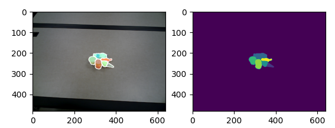

# self-supervised-segmentation

Self-supervised object segmentation via multi-object tracking and mask propapagtion based on video object segmentation.

### Introduction

This is the object segmentation code in the following paper. [arXiv](https://arxiv.org/abs/2302.03793), [Project](https://irvlutd.github.io/SelfSupervisedSegmentation/)

### License

The code is released under the MIT License (refer to the LICENSE file for details).

### Citation

If you find the package is useful in your research, please consider citing:

	@article{lu2023self,
	  title={Self-Supervised Unseen Object Instance Segmentation via Long-Term Robot Interaction},
	  author={Lu, Yangxiao and Khargonkar, Ninad and Xu, Zesheng and Averill, Charles and Palanisamy, Kamalesh and Hang, Kaiyu and Guo, Yunhui and Ruozzi, Nicholas and Xiang, Yu},
	  journal={arXiv preprint arXiv:2302.03793},
	  year={2023}
	}
	
### Installation

1. Set up XMem for video object segmentation. Follow instruction here [XMem](https://github.com/hkchengrex/XMem). After that, create a symbol link of XMem in the root folder this repo.

2. Set up MMFlow for optical flow estimation. Follow instruction here [MMFLow](https://github.com/open-mmlab/mmflow).

3. Install python packages
   ```Shell
   pip install -r requirement.txt
   ```
   
### Usage

1. Download our sample dataset from here for testing [data.zip](https://utdallas.box.com/s/v89eldmysey3vlx01yqb7waqdck2uxpb), and unzip it to the root folder

2. Run the following python script
   ```Shell
   python object_tracking.py
   ```
   The code will run over the image sequences under the data folder, and generate the final segmentation masks of all the images.
   Here is one example output:
   <p align="center"></p>
